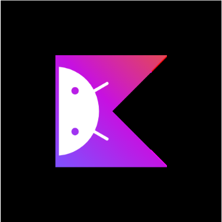
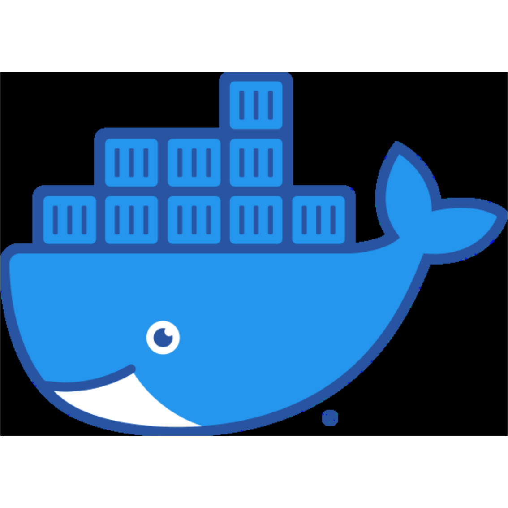

<h1 align="center"> Hello there, I'm Pankaj Khushalani

</h1>

 
<ul> 
    👨🏻‍💻 Third Year Student of Information Technology at Veermata Jijabai Technological Institute 
</ul>
<ul> 
    ☁️ Currently building <a href="https://github.com/DSC-VJTI/a-z-cloud"> A-Z Cloud</a> 
</ul>
<ul> 
    🛠︎ Currently revamping the <a href="https://github.com/pk-218/NoteKeeper"> NoteKeeper</a> backend using NestJS
</ul> 
<ul> 
    📫 Reach me at <b><a href="mailto:pankajkk218@gmail.com">pankajkk218@gmail.com</a></b> 
</ul>
 

<h2>🛠 Languages and Tools</h2>

</img>
</img>
</img>
</img>
</img>
</img>
</img>
</img>
</img>
</img>
</img>
</img>
</img>
</img>
</img>
</img>

 

<h2> 📊 Some Statistics </h2>

  
   

 

## 💻 Let's Connect

  

